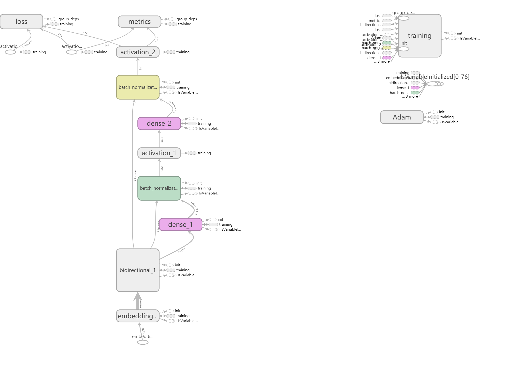

# XSS Payload 检测

## 依赖环境

scikit-learn, tensorflow, keras, numpy

## 研究方法

本次实验采用[deep-xss](https://github.com/das-lab/deep-xss)数据集

### SVM

提取了以下几种特征

- 包含 xss 常见词(字符)的个数，常见词集如下`["java", "script", "iframe", "<", ">", "\"", "\'", "%", "(", ")"]`
- 是否包含常见的关键词，使用的关键词如下`["info=", "userinfo=", "id=", "password=", "passwd=", "pid=", "email=", "cid="]`
- 字符串长度
- 包含的编码种类

最后得到的分类器准确率能够达到 98.49%

### 双向 LSTM 网络

使用 keras 构建了如下网络
经过两轮训练，准确率达到了 99.7%

## 模型

持久化之后的模型为双向 LSTM 网络的训练结果，可以使用 predict.py 进行预测，修改其中的 data 变量即可。
