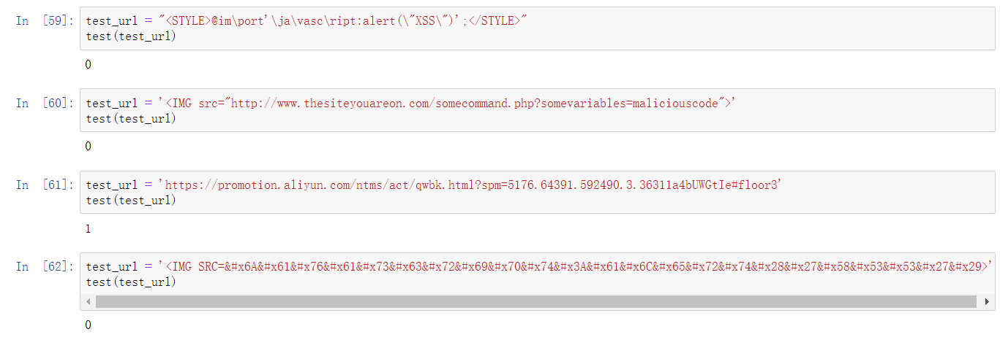

## 背景

### 1. xss的概念

#### 人们经常将跨站脚本攻击（Cross Site Scripting）缩写为CSS，但这会与层叠样式表（Cascading Style Sheets，CSS）的缩写混淆。因此，有人将跨站脚本攻击缩写为XSS。跨站脚本攻击（XSS），是目前最普遍的Web应用安全漏洞。这类漏洞能够使得攻击者嵌入恶意脚本代码到正常用户会访问到的页面中，当正常用户访问该页面时，则可导致嵌入的恶意脚本代码的执行，从而达到恶意攻击用户的目的。攻击者可以使用户在浏览器中执行其预定义的恶意脚本，其导致的危害可想而知，如劫持用户会话、插入恶意内容、重定向用户、使用恶意软件劫持用户浏览器、繁殖XSS蠕虫，甚至破坏网站、修改路由器配置信息等。

### 2. 原理

#### HTML是一种超文本标记语言，通过将一些字符特殊地对待来区别文本和标记，例如，小于符号（<）被看作是HTML标签的开始，<title>与</title>之间的字符是页面的标题等等。当动态页面中插入的内容含有这些特殊字符（如<）时，用户浏览器会将其误认为是插入了HTML标签，当这些HTML标签引入了一段JavaScript脚本时，这些脚本程序就将会在用户浏览器中执行。所以，当这些特殊字符不能被动态页面检查或检查出现失误时，就将会产生XSS漏洞。

### 3. 类型

#### 从攻击代码的工作方式可以分为三个类型：

#####（1）持久型(存储型)跨站：最直接的危害类型，跨站代码存储在服务器（数据库）。

#####（2）非持久型(反射型)跨站：反射型跨站脚本漏洞，最普遍的类型。用户访问服务器-跨站链接-返回跨站代码。

#####（3）DOM跨站（DOM XSS）：DOM（document object model文档对象模型），客户端脚本处理逻辑导致的安全问题。

#### 基于DOM的XSS漏洞是指受害者端的网页脚本在修改本地页面DOM环境时未进行合理的处置，而使得攻击脚本被执行。在整个攻击过程中，服务器响应的页面并没有发生变化，引起客户端脚本执行结果差异的原因是对本地DOM的恶意篡改利用。

### 4. 攻击方式

#### 常用的XSS攻击手段和目的有：
#### (1)、盗用cookie，获取敏感信息。
#### (2)、利用植入Flash，通过crossdomain权限设置进一步获取更高权限；或者利用Java等得到类似的操作。
#### (3)、利用iframe、frame、XMLHttpRequest或上述Flash等方式，以（被攻击）用户的身份执行一些管理动作，或执行一些一般的如发微博、加好友、发私信等操作。
#### (4)、利用可被攻击的域受到其他域信任的特点，以受信任来源的身份请求一些平时不允许的操作，如进行不当的投票活动。
#### (5)、在访问量极大的一些页面上的XSS可以攻击一些小型网站，实现DDoS攻击的效果。


## 数据处理&模型训练
### 本次项目采用 https://github.com/das-lab/deep-xss 提供的数据集。在这个数据集中有dmzo_normal.csv和xssed.csv两个文件，分别是正常请求数据集和xss的payload数据集，其中正常数据有31407条，xss数据有33426条。
### 我们首先读取两个文件中的数据，并对正常数据标记为1，对xss数据标记为0。之后我们将两个数据集合并成一个完整的data数据集，并对其进行特征工程。
### 在本次项目我们主要选取了14个特征，分别是payload长度、以及payload中script字段、java字段、iframe字段、body字段、style字段、marquee字段、<、>、双引号、单引号、%、左括号、右括号的数量。
### 由于本项目的数据量不大，特征的数量级也比较小，所以不对数据进行标准化/归一化处理。
### 在选取好特征后我们使用sklearn库构造训练集和测试集，这里我们采用8:2的比例来随机分割数据集。
### 在模型的训练中我们通过sklearn库测试了决策树、KNN、Logistics回归和SVM算法，最后通过准确率、召回率和交叉验证的方法来测试模型的效果。


## 结果分析

### 1. 采用决策树模型
#### 训练准确率为 98.41 
#### 测试准确率为 98.28
#### 召回率为 99.69
#### 交叉验证结果为 0.98 （+/- 0.01）

### 2. 采用KNN模型
#### 训练准确率为 98.21 
#### 测试准确率为 98.06
#### 召回率为 99.55
#### 交叉验证结果为 0.97 （+/- 0.01）

### 3. 采用Logistic回归
#### 训练准确率为 98.19 
#### 测试准确率为 98.34
#### 召回率为 99.87
#### 交叉验证结果为 0.98 （+/- 0.01）

### 4. 采用SVM模型

#### 训练准确率为 98.17
#### 测试准确率为 98.28
#### 召回率为 99.72
#### 交叉验证结果为 0.98 （+/- 0.01）

### 5. 测试URL判定结果



### 6. 总结

#### 根据四种模型的训练，准确率都几乎在98%以上，说明四种模型的训练都比较好，其中决策树准确率最高，但是优势并不明显。在输入url测试判定结果时，我们在网上找了四个url，包括三个xss和一个正常url，最终模型都能够成功判定。


## 改进方向

### 对于本次实践项目的特征分析与提取，我们组采用的是最常用的10个特征，即一些常见xss攻击特殊字符出现的次数，但事实上，通过对最新的xss攻击代码的分析表明，以下的特征对于xss攻击代码的预测具有更显著的效果。

### 1. 最长参数长度

#### 打个比方，一个页面，可能正常情况下，我访问一个新闻页面，他的url是长这个样子的：

#### http://www.abc.com/index.php?id=123

#### 而一条sql注入攻击呢？它可能长这个样子：

#### http://www.abc.com/index.php?id=123 and 200=201 union select 1,2,3,user(),5#--

#### 因为它需要插入一条可以带入数据库查询的语句，那么很显然，它比正常的请求要长一些。

```Python
def getfirstlen(x):
	parsed_tuple = urlparse.urlparse(urllib.parse.unquote(x))
	url_query = urlparse.parse_qs(parsed_tuple.query,True)
	url_first_arg_len = 0
	if len(url_query) == 0:
		url_first_arg_len = 0
	elif len(url_query) == 1:
		url_first_arg_len = len(url_query[list(url_query.keys())[0]][0])
	else:
		max_len = 0
		for i in url_query.keys():
			if len(url_query[i][0]) > max_len:
				max_len = len(url_query[i][0])
		url_first_arg_len = max_len
	return url_first_arg_len
```


### 2. 熵

#### 常见的攻击场景下的url，是不是看上去十分的混乱，没错，一个攻击请求由于具有更多的字符或者想要隐藏自己的目的，其自身一定会变得更加混乱，有很多甚至会进行一些编码转换（如base64,utf-7等等），混乱怎么表示？香浓告诉你：熵。

```Python
def getshan(x):
	url = x
	tmp_dict = {}
	url_len = len(url)
	for i in range(0,url_len):
		if url[i] in tmp_dict.keys():
			tmp_dict[url[i]] = tmp_dict[url[i]] + 1
		else:
			tmp_dict[url[i]] = 1
	shannon = 0
	for i in tmp_dict.keys():
		p = float(tmp_dict[i]) / url_len
		shannon = shannon - p * math.log(p,2)
	return shannon
```


### 3. 特征函数

#### 对于一个正常的请求，里面可能会有select，union，script，etc，passwd这种玩意吗？不存在的，因此我们可以依照我们的安全经验来看一看，是否存在一些具有攻击特征的字符，下面我们将其进行归类：

#### sqli类：select and or union information_schema sleep banchmark delay if concat substr ascii updatexml 

#### XSS类：script alert prompt onload onerror onmouseover onmousedown 

#### RE类：system cmd*exec exec eval cmd_*shell

#### 文件读写删包含上传类：unlink fputs fgets file_get_contents 

```Python
def getchar(x):
	lower = x
	url_ilg_sql = lower.count('select')+lower.count('and')+lower.count('or')+lower.count('insert')+lower.count('update')+lower.count('sleep')+lower.count('benchmark')+\
		lower.count('drop')+lower.count('case')+lower.count('when')+lower.count('like')+lower.count('schema')+lower.count('&&')+lower.count('^')+lower.count('*')+lower.count('--')+lower.count('!')+lower.count('null') +\
		lower.count('%')+lower.count(' ')
	url_ilg_xss = lower.count('script')+lower.count('>')+lower.count('<')+lower.count('&#')+lower.count('chr')+lower.count('fromcharcode')+lower.count(':url')+\
		lower.count('iframe')+lower.count('div')+lower.count('onmousemove')+lower.count('onmouseenter')+lower.count('onmouseover')+lower.count('onload')+lower.count('onclick')+lower.count('onerror')+lower.count('#')+lower.count('expression')+lower.count('eval')
	url_ilg_file = lower.count('./')+lower.count('file_get_contents')+lower.count('file_put_contents')+lower.count('load_file')+lower.count('include')+lower.count('require')+lower.count('open')
	count = url_ilg_sql + url_ilg_xss + url_ilg_file
	return count
```
