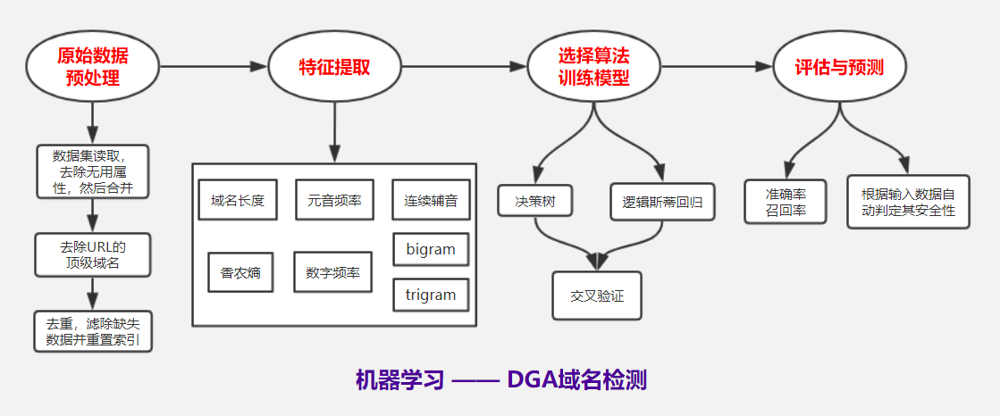

# DGA域名检测

## 什么是DGA

#### 域名生成算法(Domain Generation Algorithm，DGA)，是一种利用随机字符来生成C&C域名，从而逃避域名黑名单检测的技术手段。例如，一个由Cryptolocker创建的DGA生成域xeogrhxquuubt.com，如果我们的进程尝试其它建立连接，那么我们的机器就可能感染Cryptolocker勒索病毒。域名黑名单通常用于检测和阻断这些域的连接，但对于不断更新的DGA算法并不奏效。 

### 示例
- gwgweakshkaxnqv.org
- giwvnxpbqkvsnet.co.uk
- hxvwkpjigbybwyw.info
- bpmpfnagtcdmuuk.com
- cflqcftnjsguukr.net
- cq39cpldyvsscp4npk.biz
- sympathyre42gretcl2aim6transition.com
- trafficca77trew4ardshopfi9nance.com
- register4batsc25ale9dishw7itness.com
- impactpullcelebrateswitch.com
- linkfanaccountpostbecome.com

## 实现流程

### 原始数据预处理

1. 数据集读取，去除无用属性，然后合并。
1. 去除URL的顶级域名后缀。
1. 去重，滤除缺失数据并重置索引。

### 特征提取

1. 域名长度：DGA域名长度较长；

1. 元音频率：DGA域名中元音出现的频率小且重复率较低；

1. 连续辅音：DGA域名辅音离散度大；

1. 信息熵： DGA域名各字符出现概率接近且小；

   信息熵公式：
   $$
   H(x)=-\sum_{i=1}^{n}p(x_i)log(p(x_i))
   $$
   其中$p(x_i)$代表事件x_i的概率，在这里即表示某个字母的出现概率。信息熵作为一个系统复杂程度的度量，如果系统越复杂那么信息熵也会越大

1. 数字频率：DGA域名中使用数字的概率较高；

1. bigram： DGA域名中存在大量少见的2字符组合；

   bigram是二元分词，把句子从头到尾每两个字组成一个词语，计算式为：
   $$
   P(w_1,w_2...w_m)=\prod_{i=1}^{m}P(w_i|w_{i-1})
   $$
   利用极大似然法求出一组参数，使得训练样本的概率取得最大值：
   $$
   P(w_i|w_{i-1})=\frac{C(w_{i-1}w_i)}{C(w_{i-1})}
   $$
   

1. trigram： DGA域名中存在大量少见的3字符组合。

   trigram是三元分词，把句子从头到尾每三个字组成一个词语,计算式为：
   $$
   P(w_1,w_2...w_m)=\prod_{i=1}^{m}P(w_i|w_{i-2}w_{i-1})
   $$
   拓展：

   N-gram：假设有一个字符串s，那么该字符串的N-gram就表示按长度N切分原词得到的词段，也就是说s中所有长度为N的子字符串

   N-gram距离：
   $$
   |G_{N}(s)|+|G_{N}(t)|-2*|G_N(s)∩G_N(t)|
   $$
   其中$|G_N(s)|$是字符串s的N-gram集合，N一般取2或3

   由于数据稀疏的存在，极大似然法并不是一种很好的参数估计办法，所以引出了平滑技术，其主要策略是把在训练样本中出现过的事件的概率适当减小，然后把减小得到的概率密度分给训练语料中没有出现过的事件。

### 归一化处理

1. 对提取好的特征使用最大最小归一化算法进行归一化处理，以提升在Logistics回归模型中的收敛速度和模型精度。
2. 但是在使用决策树模型时，最好使用没有归一化处理过的数据，所以我们同时也准备了没有归一化处理过的数据。

### 选择算法并训练模型

1. 决策树
1. 逻辑斯蒂回归
1. K折交叉验证

### 预测与评估

1. 计算准确率与召回率
1. 根据输入数据自动判定其是否为DGA域名

## 结果分析

1. 当使用决策树算法构建模型对数据进行训练，当训练集和测试集的比例为8:2时，训练准确率可以达到92.76%，测试准确率可以达到91.49%，召回率可以达到91.69%。而当使用十折交叉验证对模型进行验证时，准确率可以达到91%。

2. 当使用Logistics回归对归一化的数据进行训练时，训练集和测试集的比例为8:2，使用liblinear算法当作模型优化算法，最大迭代次数选择10000次，模型的训练准确率达到84%，测试准确率84.2%，召回率85.6%。而当使用十折交叉验证对模型进行验证时，准确率有84%。

3. 我们还设置了test_domain()函数可以对传入的域名进行DGA检测。在实验中我们测试了两个正常域名和一个DGA域名，检测结果均正确，模型效果较好。

## 改进

深度学习是机器学习中一种基于对数据进行表征学习的方法，其好处是用非监督式或半监督式的特征学习和分层特征提取高效算法来替代手工获取特征。随着数十年的不断发展，深度学习在过去四五年间一直很受欢迎。再加上硬件的不断升级优化(如GPU的并行处理改进)，也使得培训复杂网络成为了可能。LSTM是一种RNN的特殊类型，可以学习长期依赖信息，如文本和语言等。LSTM是实现循环神经网络的一个这样的技巧，意味着包含循环的神经网络。LSTM在长时间的学习模式方面非常擅长文本和言语，适合用于本次实践的内容。

使用深度学习的一大好处就是我们可以省去特征工程这一繁杂的过程。如果我们使用常规方法来生成一长串特征列表(例如长度，元音，辅音以及n-gram模型)，并使用这些特征来识别DGA生成域和非DGA生成域。那么就需要安全人员实时的更新和创建新的特征库，这将是一个异常艰巨和痛苦的过程。其次，一旦攻击者掌握了其中的过滤规则，那么攻击者就可以轻松地通过更新其DGA来逃避我们的检测。而深度学习的自动表征学习能力，也让我们能够更快的适应不断变化的对手。同时，也大大减少了我们人力物力的巨大投入。LSTM技术的另一个优点是，我们仅对域名进行分类而不使用任何上下文功能如NXDomain。上下文功能的生成往往需要额外昂贵的基础设施(如网络传感器和第三方信誉系统)。令人惊讶的是对于没有上下文信息的LSTM，执行却明显优于它们。 
